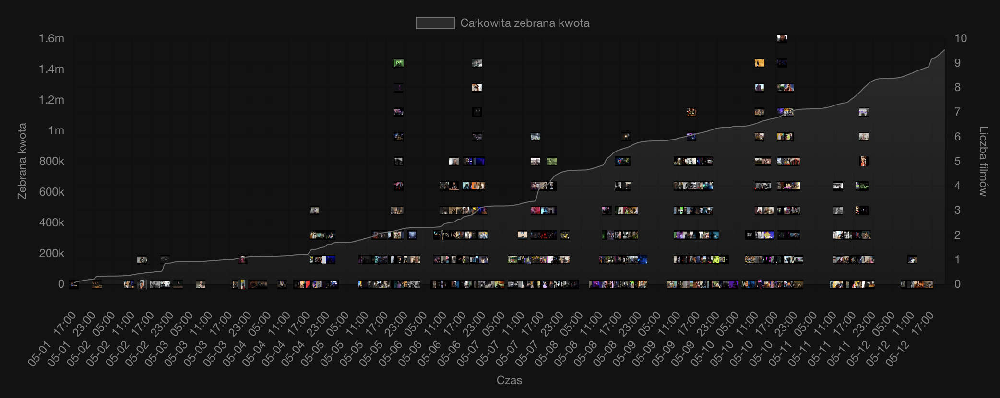
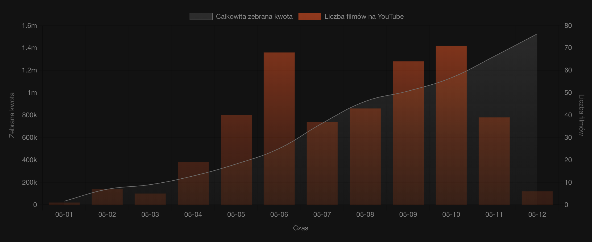

# :chart_with_upwards_trend: hot16challenge2 statistics

This repository contains exemplary statistics of hot16challenge2 built as an application with Django and Vue.

## Charts

### Amount collected with songs on YouTube



### Amount collected and cumulative number of songs on YouTube



## Tech stack

- [Vue](https://github.com/vuejs/vue)
- [Vue-chartjs](https://github.com/apertureless/vue-chartjs)
- [Django](https://github.com/django/django)

## Requirements

- [Docker](https://docs.docker.com/install/)
- [Docker Compose](https://docs.docker.com/compose/install/)

## Usage

```bash
docker-compose up
```
